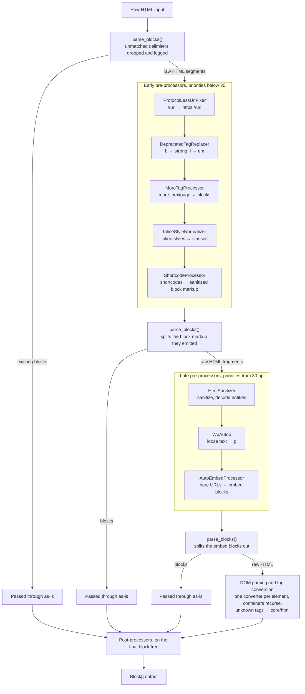

# Block Converter

[](https://github.com/nlemoine/block-converter/actions/workflows/qa.yml)
[](https://codecov.io/gh/nlemoine/block-converter)
[](https://phpstan.org/)
[](https://packagist.org/packages/n5s/block-converter)

Convert legacy or arbitrary HTML content into WordPress Gutenberg blocks.

If you're migrating content from a legacy CMS, an old WordPress installation, or a database dump full of raw HTML and shortcodes, this library turns that content into proper block markup.

## Installation

```bash
composer require n5s/block-converter
```

Requires PHP 8.3+ and a WordPress environment (the converter relies on WordPress functions like `parse_blocks()`, `wp_oembed_get()`, and the `$allowedposttags` global).

### Optional: UTF-8 repair

`Utf8Fixer` repairs mojibake and invalid byte sequences in legacy content. It is opt-in and needs an extra package:

```bash
composer require voku/portable-utf8
```

```php
use n5s\BlockConverter\PreProcessors\Utf8Fixer;

$converter->getRegistry()->registerPreProcessor(new Utf8Fixer());
```

`createDefault()` never registers it. Constructing it without the package throws a `LogicException` telling you what to install.

## Basic usage

```php
use n5s\BlockConverter\BlockConverter;

$converter = BlockConverter::createDefault();

// Convert HTML to Gutenberg block markup
$blockMarkup = $converter->convert($post->post_content, $post);

// Or get an array of Block objects
$blocks = $converter->convertToBlocks($post->post_content, $post);
```

The second argument (`$post`) is optional. It's passed through to all converters and processors, so custom implementations can use it for post-specific logic.

### Mixed content

The input does not have to be all legacy HTML. A post that was partly edited in Gutenberg, or a corpus where a previous migration converted some posts and not others, holds block markup and raw HTML side by side. The converter runs `parse_blocks()` first and only converts the raw segments; existing blocks are handed back exactly as they came in, attributes included, and the pre-processors never see their contents. Running the converter twice on the same content yields the same result.

```php
$converter->convert(<<<'HTML'
<!-- wp:heading -->
<h2 class="wp-block-heading">Already a block</h2>
<!-- /wp:heading -->
<p>Still legacy HTML.</p>
[gallery ids="1,2"]
HTML);
```

The heading block comes back untouched; the paragraph becomes a `core/paragraph` and the shortcode a `core/gallery` (or a `core/shortcode` block if its attachments cannot be found). A delimiter that opens a block nothing closes, or closes one nothing opened, is dropped and logged instead of being left to swallow the rest of the post, which is what `parse_blocks()` does on its own.

## What gets converted

### HTML tags

| HTML | Block | Notes |
|---|---|---|
| `<p>` | `core/paragraph` | Preserves text alignment classes |
| `<h1>`..`<h6>` | `core/heading` | Detects level and alignment |
| `` | `core/image` | Resolves WP attachment IDs, alignment, linked images |
| `<figure>` | `core/image` | Figure wrapping an image (optionally linked) plus an optional `<figcaption>`; this is what WordPress emits when it renders `[caption]`. Anything else falls back to `core/html` |
| `<ul>`, `<ol>` | `core/list` | Container block with `core/list-item` children |
| `<blockquote>` | `core/quote` | Container block, preserves alignment |
| `<table>` | `core/table` | Converts cell alignment classes |
| `<hr>` | `core/separator` | |
| `<pre>` | `core/preformatted` | |
| `<audio>` | `core/audio` | Reads `src` or the first `<source>` child, resolves attachment IDs |
| `<video>` | `core/video` | Reads `src` or the first `<source>` child, keeps poster/autoplay/loop/muted/playsinline |
| `<object>`, `<embed>` | `core/embed` or `core/html` | Reads `data`, `<param name="movie">` or a nested `<embed src>`, normalizes legacy Flash URLs, resolves via oEmbed; falls back to `core/html` when no provider claims the URL. A bare `<embed>` is stripped by the default sanitizer, see below |
| `<iframe>` | `core/embed` or `core/html` | Normalizes YouTube/Vimeo/Dailymotion/Spotify embed URLs, resolves via oEmbed; falls back to `core/html` for unknown URLs. Requires allowing `<iframe>` in the sanitizer config |
| `<a>` wrapping `` | `core/image` | Preserves link destination |

Tags without a registered converter fall back to a `core/html` block. Tags like `<br>`, `<cite>`, and `<source>` are silently skipped (they're handled as inline content by their parent).

### Shortcodes

| Shortcode | Block | Notes |
|---|---|---|
| `[gallery]` | `core/gallery` | Builds nested image blocks from attachment IDs |
| `[audio]` | `core/audio` | Supports mp3, ogg, flac, m4a, wav sources |
| `[video]` | `core/video` | Supports poster, autoplay, loop, muted, alignment |
| `[embed]` | `core/embed` | Resolves via oEmbed |
| `[caption]` / `[wp_caption]` | `core/image` | Extracts image and caption text |

### Pre-processing

Before converting HTML to blocks, the library runs a pipeline of pre-processors that clean up common legacy content issues:

| Processor | What it does |
|---|---|
| `AutoEmbedProcessor` | Converts bare URLs on their own line, or alone in a `<p>`, to embed blocks. Runs after `WpAutop`, unlike WordPress' `autoembed()`, because `wpautop()` breaks block markup; a URL on its own line inside a paragraph (`Text\nURL\nMore`) therefore stays text where WordPress would embed it inline |
| `ShortcodeProcessor` | Processes shortcodes via registered converters |
| `HtmlSanitizer` | Sanitizes HTML, decodes entities (`&eacute;` to `é`), strips unsafe tags |
| `DeprecatedTagReplacer` | Replaces `<b>` with `<strong>`, `<i>` with `<em>` |
| `InlineStyleNormalizer` | Converts inline `text-align` and `float` styles to Gutenberg classes |
| `ProtocolLessUrlFixer` | Fixes `//example.com` URLs to use the site's scheme |
| `MoreTagProcessor` | Turns `<!--more-->` and `<!--nextpage-->` into `core/more` and `core/nextpage` before the sanitizer can strip them |
| `WpAutop` | Wraps loose text in `<p>` tags (mirrors WordPress's `wpautop()`) |

## Customizing the converter

`createDefault()` gives you a fully configured converter. You can then customize it through the registry.

```php
$converter = BlockConverter::createDefault();
$registry = $converter->getRegistry();
```

### Shared lookups and oEmbed discovery

Two services are shared by every converter that needs them, because each caches an expensive lookup: `AttachmentResolver` (one unindexed `wp_postmeta` scan per image URL) and `EmbedBlockFactory` (one HTTP request per embed). Both caches only grow, and a migration is a long-lived process. Pass your own instances to `createDefault()` to keep a handle on them:

```php
use n5s\BlockConverter\Support\AttachmentResolver;
use n5s\BlockConverter\Support\EmbedBlockFactory;

$attachments = new AttachmentResolver();
$embeds = new EmbedBlockFactory(discover: true);
$converter = BlockConverter::createDefault($attachments, $embeds);

foreach ($batches as $batch) {
    // ... convert the batch ...
    $attachments->forget();
    $embeds->forget();
}
```

`discover: true` also resolves URLs no registered oEmbed provider claims, by fetching the page and reading its `<link rel="alternate">` tags. It is off by default because it turns every unrecognised URL in the corpus into an outbound request to an address the content, not you, chose. The factory's setting is the only one: `AutoEmbedProcessor`, `IframeConverter`, `ObjectConverter` and the `[embed]` shortcode all go through it.

### Adding converters

Register your own tag or shortcode converter by implementing the corresponding interface:

```php
use n5s\BlockConverter\Block;
use n5s\BlockConverter\TagConverters\TagConverterInterface;
use voku\helper\SimpleHtmlDomInterface;
use WP_Post;

class IframeConverter implements TagConverterInterface
{
    public static function tags(): array
    {
        return ['iframe'];
    }

    public function convert(SimpleHtmlDomInterface $element, ?WP_Post $post = null): Block|array|null
    {
        $src = $element->getAttribute('src');

        if ($src === '' || $src === null) {
            return null;
        }

        return new Block('html', [], (string) $element);
    }
}

$registry->registerTagConverter(new IframeConverter());
```

For tag converters, registering a converter for an already-handled tag replaces the existing one (last-one-wins).

That holds everywhere the tag is reached, not just where it appears on its own. `FigureConverter` and `LinkConverter` both delegate the image inside them, and they ask the registry for the current `img` converter at conversion time rather than holding one — so replacing it also changes what a `<figure>` or a linked image produces, and `removeTagConverter('img')` makes all three fall back to `core/html`.

A converter that needs to reach other converters declares it by implementing `RegistryAwareInterface` (the `RegistryAwareTrait` covers the boilerplate, in the shape of PSR-3's `LoggerAwareInterface`). The registry hands itself over at registration, so nothing has to be threaded through constructors:

```php
use n5s\BlockConverter\RegistryAwareInterface;
use n5s\BlockConverter\RegistryAwareTrait;

class MyConverter implements TagConverterInterface, RegistryAwareInterface
{
    use RegistryAwareTrait;

    public function convert(SimpleHtmlDomInterface $element, ?WP_Post $post = null): Block|array|null
    {
        $delegate = $this->registry?->getTagConverter('img');
        // …
    }
}
```

Converters that do not declare it never see the registry, and stay usable on their own.

### Removing converters

```php
// Remove a tag converter by tag name
$registry->removeTagConverter('object');

// Remove a shortcode converter by shortcode name
$registry->removeShortcodeConverter('gallery');
```

### Removing or replacing pre/post-processors

Pre-processors and post-processors are matched by class name (using `instanceof`, so subclasses match too).

```php
use n5s\BlockConverter\PreProcessors\WpAutop;
use n5s\BlockConverter\PreProcessors\HtmlSanitizer;

// Remove a pre-processor entirely
$registry->removePreProcessor(WpAutop::class);

// Replace one with a custom instance
$registry->replacePreProcessor(
    HtmlSanitizer::class,
    new HtmlSanitizer($customConfig),
);
```

All remove/replace methods throw `\InvalidArgumentException` if the target isn't found — this catches typos and misconfiguration early.

### Untrusted source content

Shortcodes this library has no converter for are preserved as `core/shortcode` blocks holding the original shortcode text, byte for byte, so `do_shortcode()` can still run them. That text is not filtered: `wp_kses_post()` corrupts shortcode syntax — it eats the closing quote of `[foo bar="a < b"]` and rewrites `&` inside URLs — so anything the original shortcode carried, markup included, survives the conversion.

Block markup already present in the input is handed back exactly as it came in — that is how mixed content is supported — so a `core/html` block in a legacy dump keeps whatever it holds. A delimiter that opens a block nothing closes, or closes one nothing opened, is dropped and logged rather than left to swallow the rest of the post.

Everything else the shortcode pipeline produces goes through the HTML sanitizer as a whole block before it is rendered, the same policy the rest of the content gets, so a caption or a `[caption]`'s own `` cannot carry a handler, a script scheme or a forged block delimiter into `post_content`. Shortcode text cannot escape the block that carries it either. But if you are migrating content from a source you do not trust, filter it before or after conversion rather than assuming the converter does it.

### Registering orphaned shortcodes

If your content has shortcodes from deactivated plugins, you can register them as fallback tags. They'll be wrapped in `core/shortcode` blocks so they're preserved in the editor rather than rendered as raw text:

```php
$registry->registerShortcodeTag('some_old_plugin');
```

### Customizing the HTML sanitizer

The `HtmlSanitizer` pre-processor uses [Symfony's HTML sanitizer](https://symfony.com/doc/current/html_sanitizer.html) with WordPress's `$allowedposttags` as the default allowlist, plus `<source>` — `$allowedposttags` omits it, which would strip the only URL that `<audio>`/`<video>` markup carries when it uses child sources instead of a `src` attribute. `<param>` is allowed too, so a Flash-era `<object><param name="movie" …>` keeps its URL. By default, `<iframe>` and `<embed>` tags are stripped, as kses strips them. If you want the built-in `IframeConverter` to fire, or `ObjectConverter` to see a bare `<embed>`, you must allow them in the sanitizer config:

```php
use n5s\BlockConverter\PreProcessors\HtmlSanitizer;
use n5s\BlockConverter\PreProcessors\ShortcodeProcessor;

$config = HtmlSanitizer::defaultSanitizerConfig()
    ->allowElement('iframe', ['src', 'width', 'height', 'allowfullscreen'])
    ->allowElement('embed', ['src', 'type', 'width', 'height']);

$sanitizer = new HtmlSanitizer($config);

$registry->replacePreProcessor(HtmlSanitizer::class, $sanitizer);
$registry->replacePreProcessor(ShortcodeProcessor::class, new ShortcodeProcessor($registry, $sanitizer));
```

`ShortcodeProcessor` runs the same sanitizer over the blocks its converters build, and it holds its own reference to it, so a replacement has to reach both — otherwise shortcode output keeps the default policy.

Inline styles go through WordPress' own `safecss_filter_attr()`. `$allowedposttags` lists `style` as a global attribute, but kses never honours that on its own, so mirroring the element and attribute lists without the CSS filter would leave this configuration more permissive than the kses it is built from — `background:url(javascript:alert(1))` would walk straight through. Declarations outside WordPress' allowlist are dropped, and a `style` left empty by the filter is removed with it.

That parity is the guarantee, and it is worth stating precisely: the output is no weaker than what WordPress itself would keep, which is not the same as saying every possible layout trick is impossible. `position` and `z-index` are on WordPress' allowlist and so survive here too.

You can also pass an entirely custom `HtmlSanitizerConfig` if you need full control — or pass `null` (the default) to use the WordPress allowlist.

### Writing custom pre/post-processors

```php
use n5s\BlockConverter\PreProcessors\PreProcessorInterface;
use WP_Post;

class StripTracking implements PreProcessorInterface
{
    public function priority(): int
    {
        return 3; // lower runs first
    }

    public function runsBeforeBlockParsing(): bool
    {
        return false; // true = runs on full content; false = runs on HTML fragments
    }

    public function process(string $html, ?WP_Post $post = null): string
    {
        // Strip UTM parameters from URLs, etc.
        return preg_replace('/\?utm_[^"\'>\s]+/', '', $html);
    }
}

$registry->registerPreProcessor(new StripTracking());
```

Post-processors work on the final block tree instead of raw HTML:

```php
use n5s\BlockConverter\Block;
use n5s\BlockConverter\PostProcessors\PostProcessorInterface;
use WP_Post;

class RemoveEmptyParagraphs implements PostProcessorInterface
{
    public function priority(): int
    {
        return 5;
    }

    /**
     * @param  list<Block> $blocks
     * @return list<Block>
     */
    public function process(array $blocks, ?WP_Post $post = null): array
    {
        return array_values(array_filter(
            $blocks,
            static fn (Block $block): bool => !($block->blockName === 'paragraph' && trim($block->content) === '<p></p>'),
        ));
    }
}

$registry->registerPostProcessor(new RemoveEmptyParagraphs());
```

## Building from scratch

If `createDefault()` includes too much, you can build your own converter with just the pieces you need:

```php
use n5s\BlockConverter\BlockConverter;
use n5s\BlockConverter\ConverterRegistry;
use n5s\BlockConverter\TagConverters;
use n5s\BlockConverter\PreProcessors;

$registry = new ConverterRegistry();

// Only register what you need
$registry->registerPreProcessor(new PreProcessors\HtmlSanitizer());
$registry->registerTagConverter(new TagConverters\ParagraphConverter());
$registry->registerTagConverter(new TagConverters\HeadingConverter());
$registry->registerTagConverter(new TagConverters\ImageConverter());

$converter = new BlockConverter($registry);
```

## How the pipeline works



A late pre-processor that emits block markup, as `AutoEmbedProcessor` does, must sort after `HtmlSanitizer`: the fragment is only split again once all late processors have run, and the sanitizer strips comments, delimiters included. The default set is checked for this in the test suite.

### Limitations

An element that spans a block boundary loses its structure. `<div><p>a</p><!-- wp:paragraph -->…<!-- /wp:paragraph --><p>c</p></div>` is split by `parse_blocks()` into a raw fragment holding an unclosed `<div>`, the block, and a raw fragment holding a stray `</div>`; each fragment is parsed on its own, so the first `<div>` is closed early and the last paragraph escapes it. This is inherent to splitting on block delimiters and is not repaired.

## Logging

The converter accepts an optional PSR-3 logger. It logs warnings when tags fall back to `core/html` blocks (no converter found):

```php
$converter = new BlockConverter($registry, $logger);
```

## License

MIT. See [LICENSE](LICENSE).
